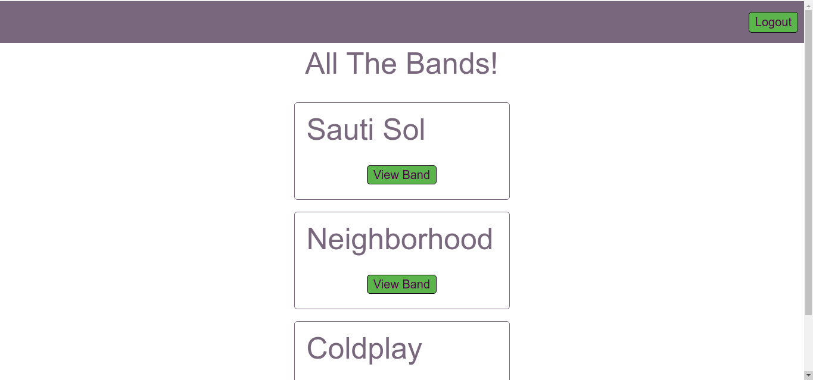
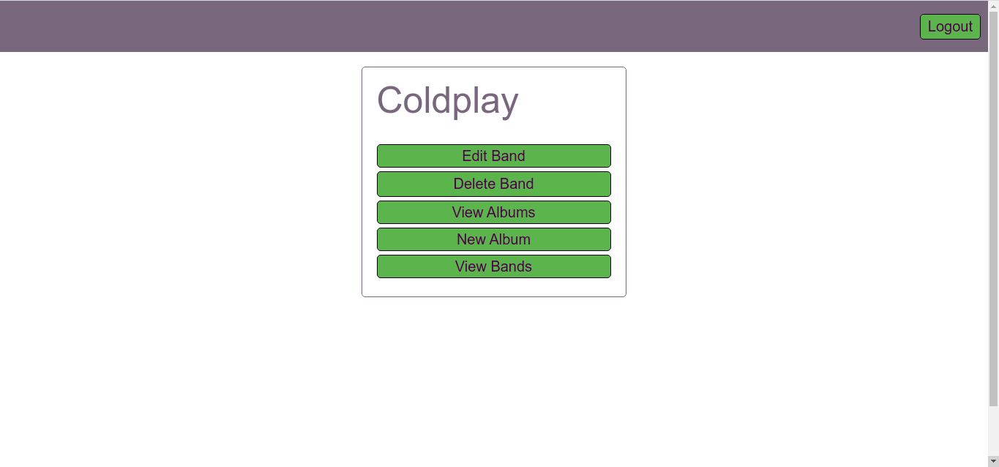
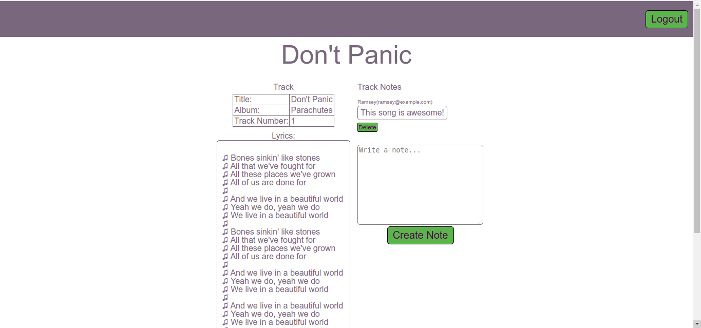

# Music Inventory App

This project involves all the major aspects of Rails, excluding testing. I built a music inventory app, where users can create accounts, set up bands, add albums with tracks, record notes on those tracks, and view the lyrics.

Below are some screenshots for demonstration:

The bands index page:

Viewing a single band:

Viewing an album track with its lyrics and notes:

In this project, I

- Build authentication from scratch. It involves a single session per user, which means you can only be logged in from one browser at a time.
- Work extensively with Rails view, rounding out the V in MVC.
- Use Rails view helpers extensively to clean up view code.
- Restrict many actions for unregistered and unlogged-in users. This was a good study in authentication and how you can use it to implement authorization.

## Built With

- Ruby 2.5.0
- Ruby on Rails 5.2.6
- Postman 7.33.0

## Getting Started
- Clone the project to your local machine;
- `cd` into the project directory;
- Run `bundle install` to install the necessary gems;
- Run `rails db:create`;
- Run `rails db:migrate`;
- Run `rails s` to start a server in your computer;
- Run `rails routes` to see the available API endpoints (ignoring Rails generated routes, of course);
- Test each of them with Postman. You can find out how to install postman [here](https://www.getpostman.com/)
- Test view manually. There is no test suite for this project, though there might be one in te future.

## My Social Handles

- Github: [@RamseyNjire](https://github.com/RamseyNjire)
- Twitter: [@untakenramram](https://twitter.com/untakenramram)
- Linkedin: [Ramsey Njire](https://www.linkedin.com/in/ramsey-njire-51984931/)

## 🤝 Contributing

Contributions, issues and feature requests are welcome!

Feel free to check the [issues page](issues/).

## Show your support

Give a ⭐️ if you like this project!

## 📝 License

This project is [MIT](lic.url) licensed.

